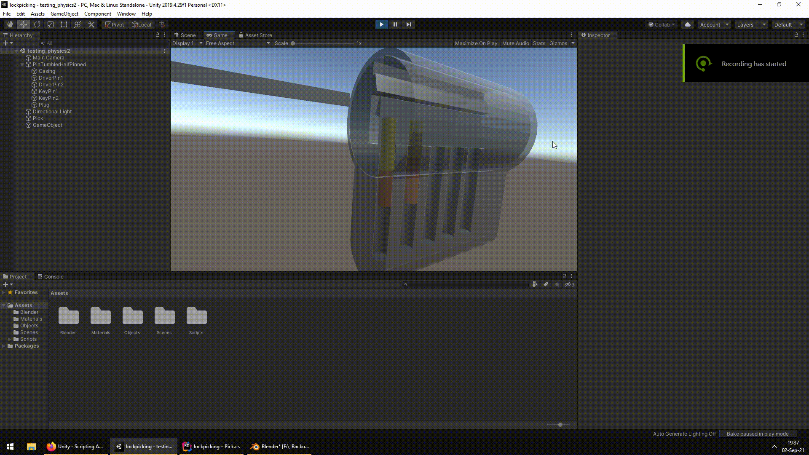
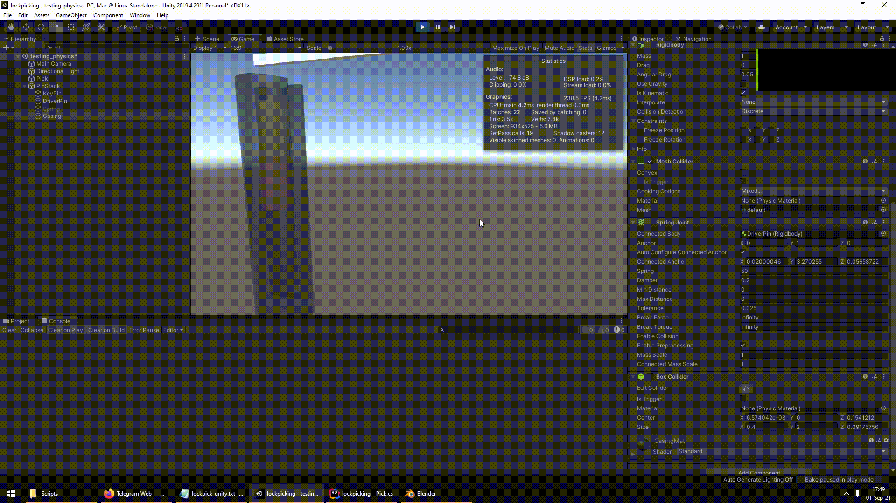
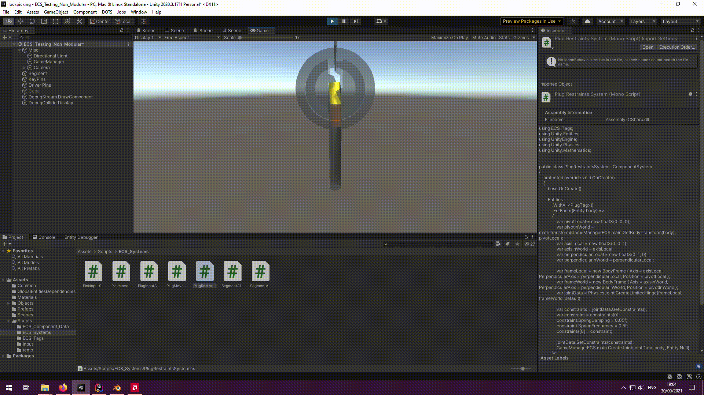
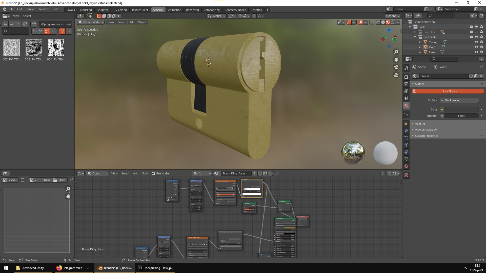

# Lockpicking Game

<!--ts-->

- [Idea](#idea)
- [Mechanics of Realworld Lockpicking](#mechanics-of-realworld-lockpicking)
  - [Anatomy of a Lock](#anatomy-of-a-lock)
  - [Binding Order](#binding-order)
  - [Picking a Lock](#picking-a-lock)
- [Our Approach](#our-approach)
  - [Realism](#realism)
  - [Physics](#physics)
  - [Rumble](#rumble)
- [Troubles](#troubles)
  - [Input System](#input-system)
  - [Physics Engine](#physics-engine)
  - [Entity Component System](#entity-component-system)
  - [Missing Preview Packages in Unity 2020](#missing-preview-packages-in-unity-2020)
  <!--te-->

## Idea

We started off with a frustration about the current representations of lockpicking in video games. Big titles feature minigames that try to incorporate lockpicking into the game flow. However, none of them really capture the mechanics of real-world locks in an accurate way. [This video](https://www.youtube.com/watch?v=Wp2AsXQVqEo&ab_channel=LockNoob) picks some of them apart and describes their flaws.

We decided to improve the situation and wanted to design a game that adequately simulates the experience of picking a lock. Two major points were important to get this right:

1. Use of real-world lock mechanics
2. Use of tactile feedback over visual feedback

Unfortunately we ran out of time due to a number of problems that made this game more complex than anticipated. Nonetheless, it was an incredible learning experience for all of us. Before diving into the game design itself, it is important to cover the basics of lockpicking.

## Mechanics of Realworld Lockpicking

### Anatomy of a Lock

A typical pin-tumbler lock consists of a cylinder (the green part in the picture below) and a plug (the yellow part). The cylinder acts as the casing, holding the inner workings of the lock. The plug is the part where the key gets inserted into. If the key is the correct key fitted for the lock, it can be turned, rotating the plug within the cylinder. The rotating motion of the plug then moves a bolt (not depicted in the image) which unlocks the door.

Pin chambers have been drilled through the cylinder and plug which contain springs, driver pins (the blue parts) and key pins (the red parts). In the default position, the springs push the pins down. The line at which the pin chambers in the cylinder and pin chambers in the plug are touching, is called the _shear line_. In the default position of the lock, the driver pins cover this line which prevents the plug from rotating.

When the correct key is inserted, its shape pushes the individual pins upwards such that the gap between driver pins and key pins is perfectly aligned with the shear line. This allows the plug to be rotated as nothing is blocking it anymore.

### Binding Order

One characteristic of such types of locks can be exploited by lockpickers. Any pin chamber needs to be drilled into the cylinder and plug. Ideally, the chambers would perfectly align on a single line. But due to manufacturing imperfections that are inevitable, there are misalignments on a µm-level.
This means that when tension is put on the plug (by trying to rotate it), not all pins block it from rotating simultaneously. Only the pin that first touches the inner walls of the plug, that is the pin chamber that has been drilled with the biggest clockwise offset, effectively keeps the plug from rotating. If this pin were to be removed, the pin with the second biggest offset would block the plug.

The order in which the pins block the plug is an internal characteristic of each lock. This order has ocurred by chance during the manufacturing of the lock, it is also called the _binding order_.

### Picking a Lock

When a lockpicker tries to open a lock without a key, they try to exploit the binding order property of a lock. First, the lockerpicker uses a so called _tension wrench_ to rotate the plug until it is blocked by one of the pins (notably the first pin in the binding order).

The lockpicker then uses a pick to touch and feel the individual pins. Because a spring is pushing them down, the individual pins can be pushed up by applying some light pressure upwards.

The pin that is currently blocking the plug from rotating should feel harder to press than the others, as this is the one that is currently in friction with the plug. Once that pin, the _binding pin_ has been identified, it needs to be pushed upwards to align the shear line between the driver and key pins (as shown in the image above with the fitting key).
As the tension wrench still tries to rotate the plug, it should be able to rotate just a tiny little bit further until the next pin in the binding order is blocking.

The lockerpicker then continues their way through all of the pins. Once all of them have been separated at the shear line, the plug can be fully rotated unlocking the lock.

## Our Approach

To reiterate, we decided to design a game that adequately simulates the experience of picking a lock.
We wanted to incorporate all of the factors described above as realistically as possible.

The behavior of pins within a lock is reasonably complex.

On top of this, the experience should be as immersive as possible.

### Realism

Most lockpicking minigames don't even get the basic mechanics of locks right. It was clear for us that we wanted to provide this realism with our game. This meant for us we needed to implement the following features:

1. A simulation of spring, driver pins and key pins
2. A rotatable plug within a cylinder
3. Some way of pushing a pin upwards from player input (if time allows with an animation of the pick)
4. Some way of varying the depth of the pick within the lock (in order to move between pin stacks)
5. Some form of feedback to distinguish binding pins from non-binding pins
6. Some way of rotating the plug from player input (if time allows with an animation of the tension wrench)
7. A mechanism that keeps pins in place when they were binding and have been pushed upwards by the pick
8. A random binding order from lock to lock

A showcase of an early version:

### Physics

In principle, most of the features could have been implemented on a purely logical basis. By taking the pick position, scaling the spring and moving the pins along the z-axis. However, lockpicking can be very nuanced in that slight variations of alignments and pressures can have a very different feel. We wanted to incorporate these nuances into our game. Also, having such a powerful game engine as the one Unity provides at our finger tips was a temptation that was hard to resist.

An early prototype of our physics-based pin stack implementation:

### Rumble

A big part of lockpicking is undoubtadly the haptic experience of it. Locks are usually opaque and are hidden within doors or lock casings which makes lockpicking solely relying on visual clues very impractical and unrealistic. Rather, feeling the resistance when pushing against a pin, hearing the clicking sounds of a pin binding and sensing the give-in of the tension wrench once a pin has been locked are what makes lockpicking possible.

Instead of following existing games with their attempts of visually simulating lockpicking scenarions, we wanted to lift the experience to a more realistic level.

As the haptics are this important, we wanted to utilize the rumbling functionality in game pads. Most game pads contain two motors to exert vibrations, one high and one low frequency motor. By controlling each of the motors individually, we can finely adjust the feedback given to the player. This would allow us to introduce the player with the full concepts of lockpicking at earlier, easier stages of the game and later hide the lock internals forcing the player to fully rely on non-visual feedback.

## Troubles

### Input System

As it turns out, rumble functionalities across game pads are not as standardized as we thought they were. After having some trouble with even triggering a rumble on macOS, we moved from the standard `Input` library to [`InputSystem`](https://docs.unity3d.com/Manual/com.unity.inputsystem.html). Next to offering more functionality this library unfortunately added some complexity to the handling of player input.

### Physics Engine

We created the 3D model of the lock in Blender and later assigned rigid bodies to its parts. This worked fine until we stumbled upon another issue: The current physics engine of Unity does not support non-kinematic, non-convex meshes. Because the model of the plug needs to be both non-kinematic (it needs to be rotated by exerting a rotational force) and non-convex (the carving where the key is inserted is concarve), it could not be simulated by using physics.

We evaluated two workarounds:

1. _Compound Colliders_ - a collection of primitive colliders that approximates the total shape of the plug
2. An alternative physics engine

The first workaround would have required a lot of _not-so-fun_ work trying to get the shape right. It was also likely to result in a worse experience than using the original mesh.

Therefore, we decided to go with the [Havok Physics Engine](https://assetstore.unity.com/havok). This way we were able to use our existing plug mesh for rigid body physics while supposedly getting better performance and accuracy.

Unfortunately, this decision came with a major drawback. The Havok preview packet only comes with support for the new Unity ECS (Entity Component System).

### Entity Component System

The next step was to migrate our project to the new system. We had to relearn the ways objects in Unity interact under this new paradigm. On the other hand, we managed to improve our collision detection:

Nevertheless, the switch to ECS was painful as the API is much less stable and less documentation exists. Due to the lack of interaction in the inspector, the development experience was also heavily degraded compared to the OOP workflow.

Also, along with the switch to Havok, we had to update our Unity project version from 2019 to 2020 in order to benefit from newer and more stable preview versions. This however led to the next problem: missing packages.

### Missing Preview Packages in Unity 2020

Because of [changes to the way preview packages are handled in the package manager](https://medium.com/@jeffreymlynch/where-are-the-missing-preview-packages-in-unity-2020-3ad0935e4193) in Unity v2020, some preview packages (such as the [Hybrid Renderer](https://docs.unity3d.com/Packages/com.unity.rendering.hybrid@0.11/manual/index.html)) had been removed from the package manager.

This took us a while to troubleshoot and we could only find the problem after watching some transforms in the entitity debugger.

All in all we ran into time pressure and ultimately couldn't finish the project. Our final version using ECS can be seen here:

And a more polished version of the model in Blender here:

